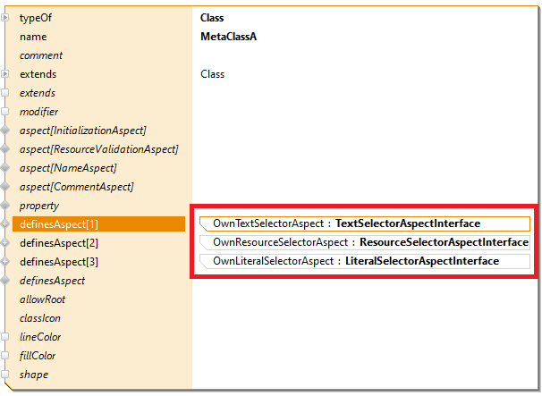
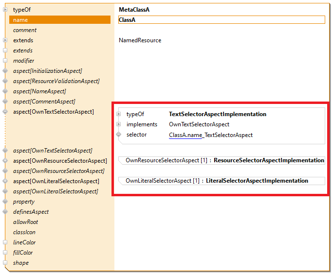

# Own Metamodel Aspects 
In this example project you will learn to define your own metamodel aspects 

## Requirements
Actifsource Workbench Community Edition

## License
[http://www.actifsource.com/company/license](http://www.actifsource.com/company/license)
